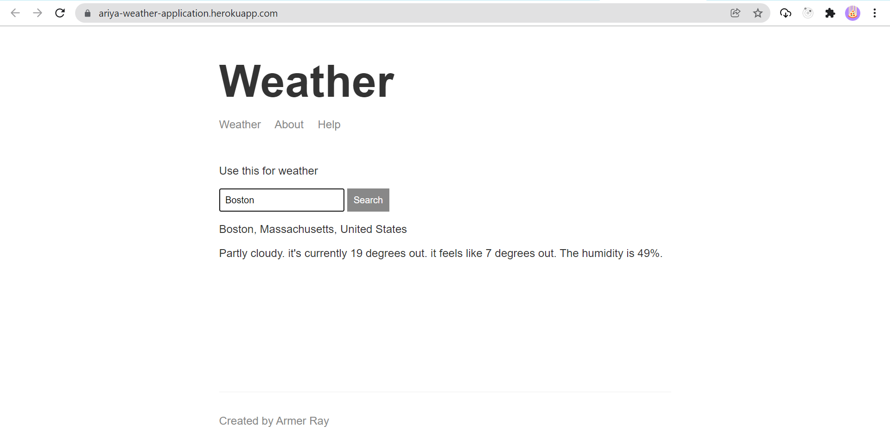

# WEATHER APP



> Track current weather

---

### Table of Contents

You're sections headers will be used to reference location of destination.

- [Description](#description)
- [How To Use](#how-to-use)
- [References](#references)
- [Author Info](#author-info)

---

## Description

Weather is unpredictable and complex. This project helps user to know weather today and give user information about temperature and humidity so user can have an insight its weather by location or another location in the world. [Try live demo](https://ariya-weather-application.herokuapp.com/).

#### Technologies

- Express
- Node JS
- HBS

[Back To The Top](#read-me-template)

---

## How To Use

#### Installation

```html
npm init
```

#### Run script

```html
npm start
```

[Back To The Top](#read-me-template)

---

## References

- [Request](https://www.npmjs.com/package/request)
- [Geocode](https://docs.mapbox.com/)
- [Forecast](https://weatherstack.com/documentation)

[Back To The Top](#read-me-template)

---

## Author Info

- Twitter - [@armerayfrndy](https://twitter.com/armerayfrndy)
- LinkedIn - [@armeray](https://www.linkedin.com/in/armer-ray-aa1b2411b/)

[Back To The Top](#read-me-template)
